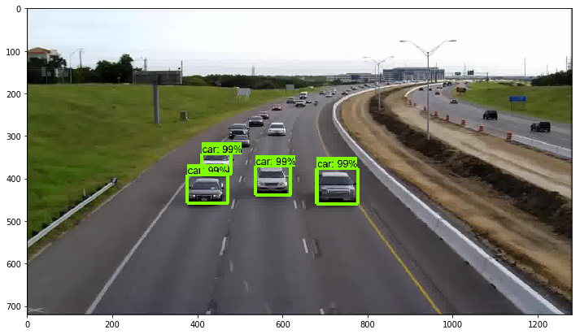

# Car Detection for surveillance 1080p video
This project is to detection cars from high way video.
Explicitly bounding box for every car and label it as 'car'.
Also tracking as the same car for specifying it a unique id until run out of screen.
Finally, this project count cars passing through,
and display total count number on top-left region.
  
The project separate the following components:
- Object Detection API from tensorflow project
- Tracker API from opencv 3.6

  

[Video of this project.](https://www.youtube.com/watch?v=2yF5Bz_R6DI&feature=youtu.be)

## Table of contents
Quick Start:

* <a href='car_detection.ipynb'>
  Quick Start: Jupyter notebook for car inference</a> 

Setup:

* <a href='doc/installation.md'>Installation</a> 

How to:

* <a href='doc/labelimg.md'>Label custom images</a> 
* <a href='doc/transfer_video_to_images.md'>Transfer video to images</a> 
* <a href='doc/xml_to_csv.md'>Convert xml to csv file</a> 
* <a href='doc/generate_tfrecord.md'>Generate TF Record</a> 
* <a href='doc/config_setting.md'>Set config</a> 
* <a href='doc/train.md'>Train model</a> 
* <a href='doc/export_inference_graph.md'>Export inference graph</a> 

Running:

* <a href='doc/car_detection_for_video.md'>
        Running the code of car detection, tracking, and counting for surveillance video.</a> 

